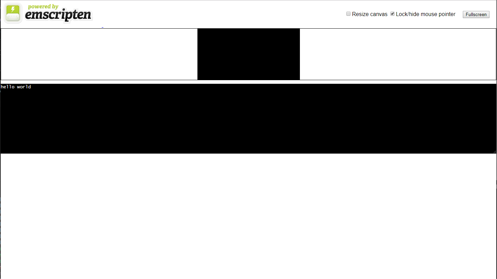
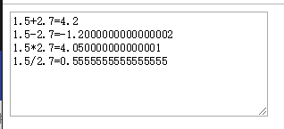
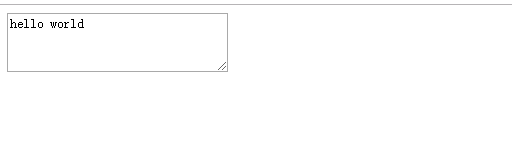

# wasm

## 环境搭建(linux)

[https://webassembly.org/getting-started/developers-guide/](https://webassembly.org/getting-started/developers-guide/)

1. 安装 python2.7

2. 克隆代码

```bash
git clone https://github.com/emscripten-core/emsdk.git
```

3. 搭建环境

```bash
cd emsdk
./emsdk install latest
./emsdk activate latest
source ./emsdk_env.sh --build=Release
```

**注意**：必须在 bash 下执行

## Hello World

helloworld.cpp:

```cpp
#include <iostream>

using namespace std;

int main()
{
    cout<<"hello world"<<endl;
}
```

使用命令行编译：

```bash
emcc helloworld.cpp -o hello.html -s WASM=1
```

- -s WASM=1 指定我们想要输出。如果我们不指定它，Emscripten 将只输出 asm.js，就像默认情况下那样。

- -o hello.html 指定输出的 HTML 文件名称。

使用 emsdk 自带的 http 服务器：

```bash
emrun --no_browser --port=8080 .
```

浏览器打开[http://localhost:8080/hello.html](http://localhost:8080/hello.html)

效果如图：



## 计算函数

calc.cpp:

```cpp
#include <emscripten/emscripten.h>

extern "C" double EMSCRIPTEN_KEEPALIVE  add(double a, double b)
{
    return a+b;
}

extern "C" double EMSCRIPTEN_KEEPALIVE  sub(double a, double b)
{
    return a-b;
}

extern "C" double EMSCRIPTEN_KEEPALIVE  mul(double a, double b)
{
    return a*b;
}

extern "C" double EMSCRIPTEN_KEEPALIVE  dvi(double a, double b)
{
    return a/b;
}
```

wasm 会移除没有调用的代码以减小体积，添加 EMSCRIPTEN_KEEPALIVE 宏会保留函数。

编译：

```bash
emcc calc.cpp -s WASM=1 -s SIDE_MODULE=1 -o calc.wasm
```

生成 calc.wasm

接下来开始编写加载 wasm 的 js：

loader.js

```js
var importObject = {
  env: {
    memoryBase: 0,
    tableBase: 0,
    __memory_base: 0,
    __table_base: 0,
    tempDoublePtr: 0,
    DYNAMICTOP_PTR: 0,
    memory: new WebAssembly.Memory({
      initial: 256
    }),
    table: new WebAssembly.Table({
      initial: 2,
      element: "anyfunc"
    }),
    abort: () => {
      throw "abort";
    },
    abortStackOverflow: () => {}
  },
  global: {
    NaN: 0,
    Infinity: 0
  }
};

function loadWebAssembly(path, imp = importObject) {
  return fetch(path)
    .then(response => response.arrayBuffer())
    .then(buf => WebAssembly.instantiate(buf, imp))
    .then(mod => mod.instance.exports);
}
```

loadWebAssembly 函数接受两个参数，第一个是 wasm 文件的路径，第二个是导入信息（后文介绍）。

使用 fetch 获取到指定路径文件的数据，然后使用 WebAssembly.instantiate 编译并实例化为一模模块（类型为 WebAssembly.WebAssemblyInstantiatedSource），然后获取一个实例的一组导出接口。

然后我们在 html 中使用：

index.html

```html
<html>
  <head>
    <meta charset="utf-8" />
  </head>
  <body>
    <textarea id="output"></textarea>
  </body>
  <script src="loader.js"></script>
  <script>
    loadWebAssembly("./calc.wasm").then(exports => {
      const add = exports._add;
      const sub = exports._sub;
      const mul = exports._mul;
      const dvi = exports._dvi;
      var outputEle = document.getElementById("output");
      outputEle.value =
        "1.5+2.7=" +
        add(1.5, 2.7) +
        "\n1.5-2.7=" +
        sub(1.5, 2.7) +
        "\n1.5*2.7=" +
        mul(1.5, 2.7) +
        "\n1.5/2.7=" +
        dvi(1.5, 2.7);
    });
  </script>
</html>
```

HTML 中使用 loadWebAssembly 加载 calc.wasm，加载完毕后获取定义的 4 个函数、然后调用这 4 个函数测试，并显示在 textaera 中。

启动 http 服务器。

```bash
emrun --no_browser --port=8080 .
```

浏览器打开

在浏览器打开[http://localhost:8080/hello.html](http://localhost:8080/hello.html)

效果如图：



## 自定义 HTML 模板

在 hello world 例子中，我们使用了 emcc 直接编译出 html 文件，文件中会有一些不属于程序自身的图片。这里我们使用自定义分如 html 模板生成程序。

编写模板 hello_template.html

```html
<html>
  <head> </head>
  <body>
    <textarea id="output"></textarea>

    <script>
      var output = document.getElementById("output");
      var Module = {
        print: function(str) {
          output.value = output.value + str + "\n";
        }
      };
    </script>
    {{{ SCRIPT }}}
  </body>
</html>
```

使用模板：

```bash
emcc -o hello.html --shell-file hello_template.html -s WASM=1 helloworld.cpp
```

生成 hello.html

运行服务器，通过浏览器访问：


